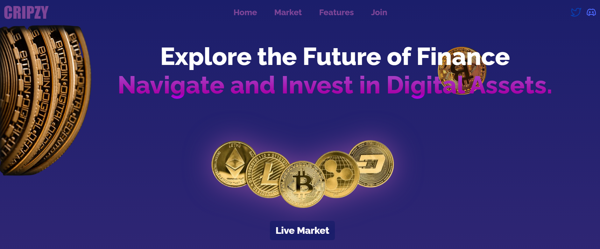
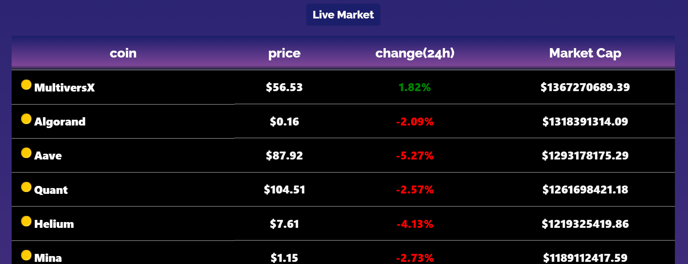

# cripzy The Crypto Tracker website

Welcome to my portfolio website! This website showcases my skills, projects, and experiences as a web developer.

## Table of Contents
- [Demo](#demo)
- [Technologies Used](#technologies-used)
- [Usage](#usage)
- [Screenshots](#screenshots)
- [License](#license)

## Demo
[Live Demo](#your-live-demo-link)

## Technologies Used
- React
- TypeScript
- Redux Toolkit
- Framer Motion
- ...

## Usage
1. Start the development server: `npm start`
2. Open your browser and go to `http://localhost:5173`

## Screenshots

## License
This project is licensed under the [MIT License](LICENSE).
